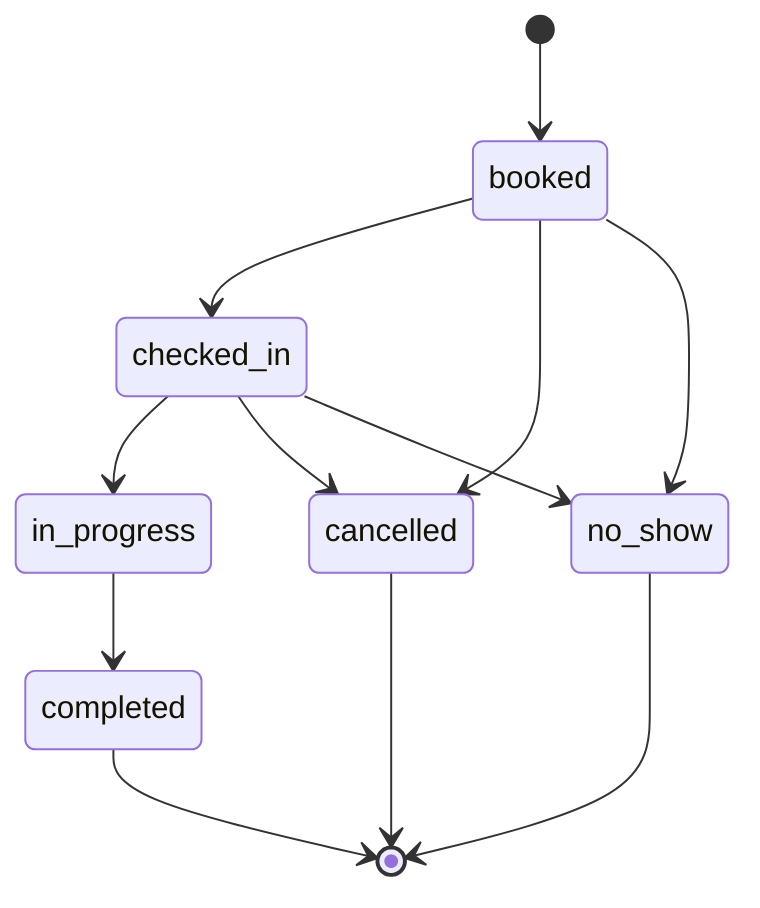

# Design Decisions

ภาพรวมการใช้งานและ quick start อยู่ที่ [README.md](../README.md)

## Tech stack

**NestJS + Drizzle + Postgres 16**

- **NestJS** เลือกใช้เพราะโครงสร้าง controller/service/module เข้ากับการแบ่งชั้นของโปรเจกต์นี้อยู่แล้ว
  controller ทำหน้าที่เป็น HTTP layer บางๆ
  service เป็นตัวประสานระหว่าง domain กับ DB
  และไม่ควรมี logic จากชั้นอื่นไหลเข้าไปอยู่ใน `domain/`

- **Drizzle** เป็น typed query builder มากกว่า ORM แบบเต็มตัว
  ในโปรเจกต์นี้ใช้สำหรับช่วยเรื่อง type และ query โดย migration หลักยังเขียนเป็น SQL เอง
  เพราะ constraint ที่ต้องใช้ เช่น `EXCLUDE USING gist`, generated stored column และ `CHECK` หลายคอลัมน์ ไม่ได้เหมาะกับการเขียนผ่าน migration DSL ของ ORM อยู่แล้ว

- **Postgres 16** เลือกเพราะมี exclusion constraint ที่ทำงานกับ range type ได้
  ทำให้ฐานข้อมูลสามารถป้องกันการจองเวลาทับกันได้เอง โดยไม่ต้องเขียนระบบล็อกขึ้นมาในแอป
  รายละเอียดเพิ่มเติมอยู่ใน Design decisions ข้อ 1

**Next.js + shadcn/ui**

- **Next.js** ใช้ App Router กับ client component หลักเพียงตัวเดียว
  สำหรับหน้าจองนัดที่เจ้าหน้าที่ใช้งาน แค่นี้ก็เพียงพอแล้ว
  ยังไม่จำเป็นต้องเพิ่มกลไกอย่าง RSC data fetching หรือ streaming แบบที่แอปขนาดใหญ่ต้องใช้

- **shadcn/ui** เลือกใช้เพราะสามารถเอา primitive ของ Radix/Base UI ที่ไม่มีสไตล์สำเร็จรูปเข้ามาใช้ในโปรเจกต์ได้โดยตรง
  ทำให้ประกอบพวก calendar, dialog, select และ table ได้เร็ว โดยไม่ต้องติด dependency ของ component library ทั้งชุด

## Data model

- **departments** คือแผนกของโรงพยาบาล โดยแพทย์แต่ละคนมีแผนกหลักหนึ่งแผนก
- **doctors** คือข้อมูลบุคลากรทางการแพทย์ และแต่ละคนจะสังกัดแผนกหนึ่งแผนก
- **patients** ระบุตัวตนด้วย `hn` ซึ่งย่อมาจาก Hospital Number เป็นเลขที่ใช้งานจริงในโรงพยาบาล ไม่ใช่ UUID
- **staff_users** เป็น stub เอาไว้บันทึกว่าใครเป็นคนทำรายการ โดยใช้ผ่านฟิลด์ `created_by` และ `cancelled_by` ไม่ใช่ระบบ authentication จริง
- **appointment_types** เก็บ `code`, `duration_min`, `buffer_after_min`, `min_lead_time_min`, `max_advance_days` ไว้ในตารางโดยตรง ไม่ได้ hardcode ไว้ในโค้ด ดังนั้นถ้า admin ต้องการปรับค่า ก็ไม่จำเป็นต้อง deploy ใหม่
- **doctor_schedules** เป็น template รายสัปดาห์ ไม่ใช่แถวรายวัน แต่ละแถวจะบอก `(doctor_id, day_of_week, start_time, end_time, valid_from, valid_to)` เช่น ถ้าถามว่า "วันอังคารหน้า นพ.อนันต์ออกตรวจกี่โมง" ระบบจะคำนวณจาก template ตอนมี request เข้ามา ไม่ได้สร้างแถวสำหรับวันนั้นไว้ล่วงหน้า
- **schedule_breaks** เก็บช่วงพักของแต่ละตารางเวร หนึ่งตารางเวรสามารถมีได้มากกว่าหนึ่งช่วง เช่น พักเที่ยง โดยอ้างอิงกลับไปที่ตารางเวรผ่าน `schedule_id`
- **schedule_exceptions** เอาไว้เก็บกรณีที่ template รายสัปดาห์ไม่สามารถแทนได้ มีสองแบบคือ `DAY_OFF` สำหรับวันลา และ `CUSTOM_HOURS` สำหรับวันที่มีเวลาออกตรวจพิเศษ หนึ่งแถวจะผูกกับหนึ่งคู่ `(doctor_id, exception_date)` ทำให้รองรับทั้งวันลาและวันหยุดนักขัตฤกษ์ได้
- **appointments** คือตัวนัดหมายเอง โดย `starts_at`, `ends_at`, `blocks_until` จะถูกคำนวณฝั่ง server จาก `appointment_types` เสมอ ส่วน `occupied_range` และ `clinical_range` เป็น stored column แบบ `GENERATED ALWAYS AS` ที่ใช้รองรับ exclusion constraint ตามที่อธิบายในหัวข้อถัดไป

## 1. ทำไมต้อง Postgres

exclusion constraint ที่ทำงานกับ range type ช่วยให้ database ปฏิเสธการ insert ที่มีช่วงเวลาทับกันได้เอง
ถ้าใช้ฐานข้อมูลอื่น แอปจะต้องเป็นคนเช็คและล็อกข้อมูลเองตั้งแต่ตอนตรวจสอบไปจนถึงตอนเขียนข้อมูล

เขียน logic แบบนี้ในโค้ดจุดเดียวอาจไม่ยาก แต่ปัญหาคืออนาคตอาจมี code path อื่นเพิ่มเข้ามาแล้วลืมเช็ค เช่น สคริปต์ของ admin, งาน bulk-import หรือ service ตัวที่สอง
การใช้ constraint ที่ระดับ database ทำให้กฎนี้ถูกบังคับอยู่ที่ schema เลย ไม่ต้องพึ่งว่าทุกคนที่เขียนโค้ดจะจำกฎนี้ได้ครบ

## 2. ป้องกันการจองซ้อน (double booking)

การ `SELECT` แล้วค่อย `INSERT` เป็นสองขั้นตอนที่มีช่องว่างระหว่างกัน
และการ `SELECT` อย่างเดียวไม่ได้ล็อกอะไรไว้

ดังนั้นถ้ามีสอง request เข้ามาใกล้ๆ กัน ทั้งคู่สามารถเห็นว่า slot ยังว่างอยู่ได้
จากนั้นทั้งสอง request ก็อาจ `INSERT` สำเร็จพร้อมกัน
ในระบบโรงพยาบาลจริง นั่นหมายความว่าแพทย์คนเดียวกันถูกจองคนไข้สองคนในช่วงเวลาเดียวกัน

ทางแก้ในโปรเจกต์นี้คือไม่พยายามเช็คซ้ำในแอป แต่ปล่อยให้ `INSERT` เป็นตัวตัดสินแบบ atomic:

```sql
CONSTRAINT appt_no_doctor_overlap EXCLUDE USING gist (
  doctor_id      WITH =,
  occupied_range WITH &&
) WHERE (status IN ('booked', 'checked_in', 'in_progress', 'completed', 'no_show'))
```

การเช็คกับการเขียนข้อมูลถูกบังคับไว้ด้วย constraint เดียวกัน จึงไม่มีช่องว่างให้เกิด race ระหว่างสองขั้นตอน
ถ้ามีหลาย request ยิงเข้ามาจอง slot เดียวกันพร้อมกัน จะมีแค่ request เดียวที่ `INSERT` สำเร็จ
ส่วนที่เหลือจะได้ SQLSTATE `23P01` และ API จะแปลงเป็น HTTP `409 SLOT_TAKEN` (`api/src/common/filters/app-exception.filter.ts`)

| ทางเลือก | ทำไมไม่เลือก |
|---|---|
| check-then-insert (`SELECT` แล้ว `INSERT`) | มีช่องว่างระหว่างสองคำสั่ง เพราะไม่มีอะไรล็อกข้อมูลไว้ระหว่างนั้น จึงเกิด race ได้ |
| unique index บน `(doctor_id, starts_at)` | จับได้เฉพาะกรณีที่เวลาเริ่มตรงกันเท่านั้น นัดใหม่ที่ 09:15 ยังสามารถชนกับนัด 09:00–09:30 ได้ เพราะสิ่งที่ต้องกันคือ "ช่วงเวลาทับกัน" ไม่ใช่แค่ "ค่าเวลาเท่ากัน" |
| `SELECT ... FOR UPDATE` | ไม่มีแถวที่จะล็อก เพราะนัดที่กำลังจะชนกันยังไม่มีอยู่ตอน request เข้ามา ถ้าจะล็อกสิ่งที่หยาบกว่านั้น เช่น ล็อกทั้งแถวของแพทย์ ก็จะทำให้การจองของแพทย์คนนั้นต้องรอกันทั้งหมด |
| advisory lock (`pg_advisory_xact_lock`) | ทำได้ แต่ทุก code path ที่เขียนนัดต้องจำว่าต้องล็อกก่อนเสมอ ถ้ามีจุดไหนลืมใช้ lock race ก็กลับมาได้อีก |
| isolation level `SERIALIZABLE` | ใช้แก้ปัญหาได้ในหลักการ แต่ทุกจุดที่เขียนนัดต้องรองรับการ retry เมื่อเจอ serialization failure (`40001`) และกฎเรื่องการห้ามจองทับกันก็ไม่ได้ถูกประกาศไว้ชัดเท่ากับ exclusion constraint |
| exclusion constraint (ที่เลือกใช้) | ประกาศกฎไว้ที่ schema ครั้งเดียว และบังคับใช้กับทุกคนที่เขียนข้อมูล ไม่ว่าจะเป็น API, เครื่องมือ admin ในอนาคต หรือแม้แต่การเปิด `psql` แล้วเขียนตรงๆ โดยไม่ต้องมี logic ฝั่งแอปมาช่วย |

## 3. Availability ต้องตรงกับ constraint

endpoint หา slot ว่าง (`api/src/domain/slots.ts`) ถือว่าเวลาที่นัดหนึ่งรายการกันไว้คือ `occupied_range`
ช่วงนี้เริ่มจาก `starts_at` ไปจนถึง `blocks_until` ซึ่งรวมทั้ง duration และ buffer
และนี่ต้องเป็น range เดียวกับที่ exclusion constraint ใช้ ไม่ใช่ `clinical_range` ที่นับแค่ duration ของการตรวจ

ถ้าสองส่วนนี้ใช้คนละ range จะเกิดปัญหาได้ เช่น availability บอกว่า slot ยังว่าง แต่พอ `INSERT` จริงกลับโดน constraint ปฏิเสธ
สุดท้ายผู้ใช้จะเห็น slot ว่าง กดจอง แล้วได้ 409 กลับมาซ้ำๆ

## 4. ตารางเวรเป็น template รายสัปดาห์

อีกทางเลือกหนึ่งคือสร้างแถวตารางเวรรายวันล่วงหน้าไปเรื่อยๆ
แต่แบบนั้นจำนวนแถวจะเพิ่มขึ้นเรื่อยๆ และต้องมี cron job คอยสร้างข้อมูลล่วงหน้า
ถ้าต้องแก้เวลาออกตรวจของแพทย์ ก็ต้องตามไปแก้ข้อมูลหลายแถวแทนที่จะเปลี่ยนแค่กฎเดียว

การเก็บ `doctor_schedules` เป็น template แล้วใช้ `valid_from` กับ `valid_to` ทำให้สามารถกำหนดได้ว่าเวลาออกตรวจชุดนี้เริ่มมีผลตั้งแต่วันไหนถึงวันไหน
ถ้าแก้ตารางเวร ก็มีผลกับวันที่อยู่ในช่วงนั้นไปข้างหน้า โดยไม่ไปกระทบนัดที่เกิดขึ้นไปแล้วในอดีต

สรุปง่ายๆ คือ schema เก็บ "กฎที่ใช้สร้างเวลาออกตรวจของแต่ละวัน" ไม่ได้เก็บผลลัพธ์ของกฎนั้นเป็นข้อมูลรายวันตายตัว

## 5. ลำดับการตรวจ (validation order)

`checkTimingRules` (`api/src/domain/booking-rules.ts`) ต้องใช้แค่ข้อมูลจาก request กับประเภทนัดเท่านั้น
ไม่ต้องรู้เรื่องตารางเวร และไม่ต้อง query DB
ดังนั้นระบบจะเรียกส่วนนี้ก่อนเสมอ

ตัวฟังก์ชันเองไม่ได้รับตารางเวรเป็น parameter อยู่แล้ว นี่จึงเป็นตัวช่วยบังคับลำดับในระดับโค้ด
service จะไม่สามารถเรียก `checkWorkingHoursRules` ก่อนแล้วค่อยมา resolve ตารางเวรทีหลังได้ เพราะ `checkTimingRules` ไม่มี argument สำหรับตารางเวรตั้งแต่แรก

ผลคือ ถ้า request ขอจองวันที่ผ่านมาแล้ว ระบบจะตอบ `IN_THE_PAST` ก่อน แม้แพทย์คนนั้นจะไม่มีตารางเวรในวันนั้นเลยก็ตาม
ถ้าไม่มีลำดับนี้ ผู้ใช้อาจได้รับ `OUTSIDE_WORKING_HOURS` ซึ่งทำให้เข้าใจผิดว่าปัญหาเกิดจากเวลาทำการ

แนวคิดคืออะไรที่ตรวจได้โดยไม่ต้องแตะ DB ก็ควรตรวจให้เสร็จก่อน เพื่อคัด request ที่ผิดออกไปก่อนที่จะเริ่ม query ฐานข้อมูล

## 6. Idempotency

ถ้า client ยิง request ไปแล้วเจอ timeout ก็มีโอกาส retry request เดิม
ระบบจึงต้องป้องกันไม่ให้ retry ครั้งนั้นสร้างนัดซ้ำ

`POST /api/appointments` รองรับ header `Idempotency-Key`
ถ้า key เดิมถูกใช้ไปแล้ว ระบบจะคืน appointment เดิมกลับมาเป็น HTTP 200
ไม่ใช่ 201 เพราะไม่ได้สร้างรายการใหม่ และไม่ใช่ 409 เพราะไม่ได้ถือว่าเป็น conflict

กฎนี้บังคับด้วย partial unique index บนคอลัมน์ `idempotency_key`

ส่วนการแก้ไขนัดที่มีอยู่แล้วใช้ optimistic locking ผ่านคอลัมน์ `version`
trigger `touch_row` จะเพิ่มค่า `version` ให้อัตโนมัติทุกครั้งที่มีการ update
ถ้ามีคนอื่นแก้นัดเดียวกันไปก่อนระหว่างที่เรากำลังทำรายการ ระบบจะตอบ `CONCURRENT_MODIFICATION` กลับมา

## Appointment status state machine

ตารางสถานะทั้งหมดอยู่ที่หัวข้อ Appointment status ใน [README.md](../README.md)

หลักที่ใช้ตัดสินว่าสถานะไหนยังถือว่ากิน slot คือ ถ้าสถานะนั้นหมายความว่าการนัดเกิดขึ้นแล้ว หรือกำลังจะเกิดขึ้น ก็ยังต้องกันเวลาของแพทย์ไว้

กฎนี้ถูกบังคับด้วย `WHERE` clause ของ `appt_no_doctor_overlap` และ `appt_no_patient_overlap` ตามที่อธิบายใน Design decisions ข้อ 2
ส่วน appointment ที่เป็น `cancelled` จะไม่เข้าเงื่อนไขของ constraint แล้ว slot จึงกลับมาว่างได้ทันที โดยไม่ต้องมีโค้ดพิเศษมาคอยจัดการ



(`api/src/domain/status.ts`) `completed`, `cancelled`, `no_show` ถือเป็นสถานะจบ
ถ้าพยายามเปลี่ยนไปสถานะอื่นที่ไม่ได้อยู่ในแผนภาพนี้ ระบบจะปฏิเสธด้วย `INVALID_STATUS_TRANSITION`

## Cancellation policy

การยกเลิกจะคืน slot ให้ทันที เพราะเวลาแพทย์เป็นทรัพยากรที่มีจำกัดที่สุดในระบบ
ถ้ายังกัน slot ที่ไม่มีใครใช้ต่อ ก็เท่ากับเสียโอกาสให้คนไข้คนอื่นเข้ามาใช้เวลานั้น และทำให้เวลาของแพทย์ถูกทิ้งไปโดยเปล่าประโยชน์

เวลายกเลิก ระบบจะไม่ลบแถว appointment ทิ้ง แต่จะเปลี่ยน `status = 'cancelled'` และบันทึก `cancelled_by`, `cancelled_at`, `cancellation_reason` ไปพร้อมกันในการ update ครั้งเดียว

CHECK constraint ชื่อ `appt_cancellation_complete` ช่วยบังคับว่าข้อมูลการยกเลิกต้องครบ
จะมี `status = 'cancelled'` โดยขาดฟิลด์ทั้งสามไม่ได้ และจะมีฟิลด์ทั้งสามโดยที่สถานะไม่ใช่ `cancelled` ก็ไม่ได้เช่นกัน

## Web UI: การจัดการ availability ที่ล้าสมัย

มีจุดหนึ่งที่ตั้งใจออกแบบไว้เป็นพิเศษ คือ `GET /availability` จะคืนภาพของ slot ว่าง ณ เวลาที่โหลดหน้า ไม่ใช่เวลาที่ผู้ใช้กดจอง
ระหว่างที่ผู้ใช้กำลังเลือก slot เจ้าหน้าที่อีกคนอาจจอง slot เดียวกันไปก่อนแล้ว

ถ้าเกิดกรณีนี้ ระบบจะได้ error `SLOT_TAKEN` กลับมา
หน้าเว็บจะแจ้งผู้ใช้ทันที แล้วโหลดรายการเวลาว่างใหม่ให้อัตโนมัติ แทนที่จะขึ้น error เฉยๆ แล้วปล่อยให้ผู้ใช้ต้องเดาเองว่าต้องทำอะไรต่อ

แนวคิดตรงนี้คือยอมรับว่าช่องว่างระหว่าง "เห็นว่าว่าง" กับ "กดจองจริง" ไม่สามารถปิดได้ทั้งหมด
สิ่งที่ทำได้คือออกแบบให้ระบบรับมือและกู้คืนจากสถานการณ์นี้ได้ดี

## On language and framework choice

ส่วนที่รับประกันเรื่อง concurrency ของโมดูลนี้อยู่ที่ Postgres โดยตรง คือ constraint `EXCLUDE USING gist`
ไม่ได้ขึ้นอยู่กับ NestJS หรือระบบ type ของ TypeScript

ดังนั้นต่อให้เปลี่ยน API layer ไปเขียนด้วยภาษาอื่น แต่ยังใช้ schema เดิม การรับประกันเรื่องการจองเวลาทับกันก็ยังคงอยู่เหมือนเดิม
